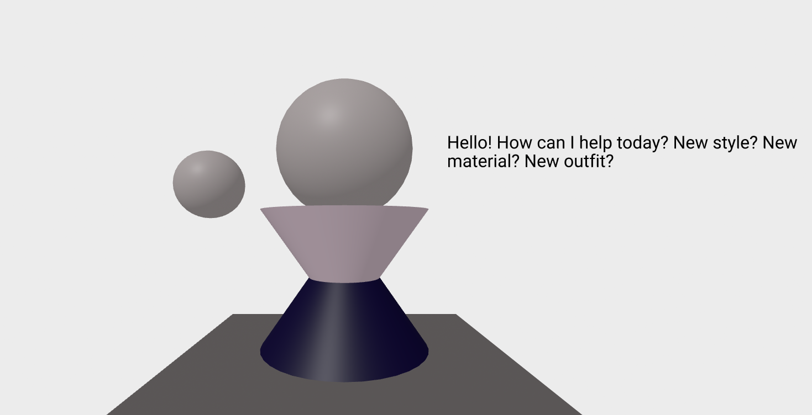
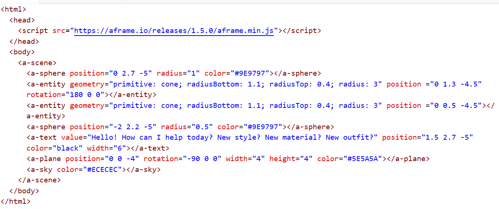

# Tool Learning Log

Tool: **Aframe**

---
2/26/24:
* Tried making a body for Blog Four
* Helped me gain knowledge on the basics

* (Keeping code here to potentially use in the future for project)

2/29/24:
* Read this website --> https://medium.com/w3bvr/learning-a-frame-adding-image-textures-5dbb7c41288
    * Allowed for me to learn about images and textures
        * (Very helpful in case for my project)
    * Helps with making our surroundings not look too plain or boring
      * `src="url link here"` is the way to put images over shapes
    * Would something like gifs or anything animated may also work to put on the shape?
    * Is there a size limit on these images when putting them on shapes?
* Result from using tutorial (Works!):

  

3/4/24:
* Watching tutorials from this channel --> https://www.youtube.com/@alexandraetienne9540
     * Has useful things to use for Aframe, like light and skyboxes

       *Merged two tutorials and got a result of making a space themed scene:

* Light helped with shading objects in a way, like in art
* Skyboxes help imagine where you are and get a better vision
     * `<a-sky src="image link here"></a-sky>` is how to be able to put a 360 image around the scene
     * `<a-light type="name here"></a-light>` can allow me to put light around the directions, with a color
          * Directional, Spot(light), hemisphere and ambient are the four different types of light (Need more reasearch on the spotlight and ambient one)
       * Example of code down below:

3/22/24:
* Learned to make more new shapes (More complex than cone, pyramid and box)
   * Tutorial was from A-frame: https://aframe.io/docs/1.5.0/components/geometry.html

   * List of shapes (Will probably use more than three here):
      * box
      * circle
      * cone
      * cylinder
      * dodecahedron
      * octahedron
      * icosahedron
      * plane
      * ring
      * sphere
      * tetrahedron
      * torus
      * torusKnot
      * triangle

Example of some shapes (cone, icosahedron and octahedron):

Code:

   * `radiusBottom;` and `radiusTop` seems to be what allows for the cone to be the shape it is, I tried changing that and it didn't look the same anymore

   * Setting the `radiusTop` to 1.5 and the `radiusBottom` to 0.8 changed the shape entirely and made it look more like a trapezoid(?) now
   * This could be another way to make more shapes not included
      * I still wonder if custom shapes can be made?
      * All shapes have primitive in the code, which could be name of the shape
      * Is there a way to be able to put text over these shapes?
   *  Next time I will try to find a way to be able to put text over these shapes

3/25/24:
* Learned how to insert text on A-frame:
     * This tutorial helped: https://www.youtube.com/watch?v=cHWO-nWWe5w
     * I looked into the official website and tried finding out from there
     * Didn't help since I didn't know what rendering was? I left that out
     * I looked into both the primitives and components section, both had text
     * I did <a-text>, which is what A-frame usually has, an a and a dash before the name of the primitive
     * Didn't work, until I watched tutorial
     * Had to change the A-frame's version from `1.5.0` to `0.5.0`, then the text finally worked for me
     * But I had to adjust the position for a while since it wasn't appearing

    

4/3/2024:
   * Practicing on making more of my inventions on Aframe, a small example of the product and code:

   

   

   * Tried changing the colors for the cones, it didn't work, not sure why? Will try to look into it later
      * Kept refreshing in order to get the right colors (somewhat worked)
   * Tried to change width and radius for sphere and cone, didn't work so I will look into that as well
   * Used text so that my invention, an AI fashion helper, could be communicating with the owner
   * Also used cones in order to  make a sort of body shape
      * Making a list of shapes in case I need it and forget
         * Cones or boxes for body
         * Circles for head
         * Cylinders for arms and legs maybe?
         * Plane for floor or a place to put up text
         * Other shapes will possibly be used for background/scene
   * For the next time, I will practice making background for final days of learning my tool, Aframe

<!--
* Links you used today (websites, videos, etc)
* Things you tried, progress you made, etc
* Challenges, a-ha moments, etc
* Questions you still have
* What you're going to try next
-->
